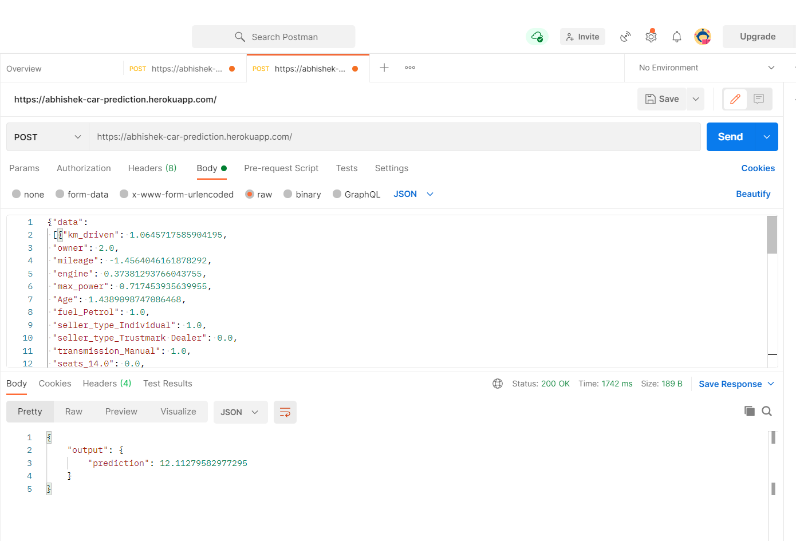

# Car-Prediction
Due to the increased price of new cars and the incapability of customers to buy new cars due to the lack of funds, used cars sales are on a global increase. There is a need for a used car price prediction system to effectively determine the worthiness of the car using a variety of features. Even though there are websites that offers this service, their prediction method may not be the best. Besides, different models and systems may contribute on predicting power for a used car’s actual market value. It is important to know their actual market value while both buying and selling.

APP LINK: https://abhishek-car-prediction.herokuapp.com/

